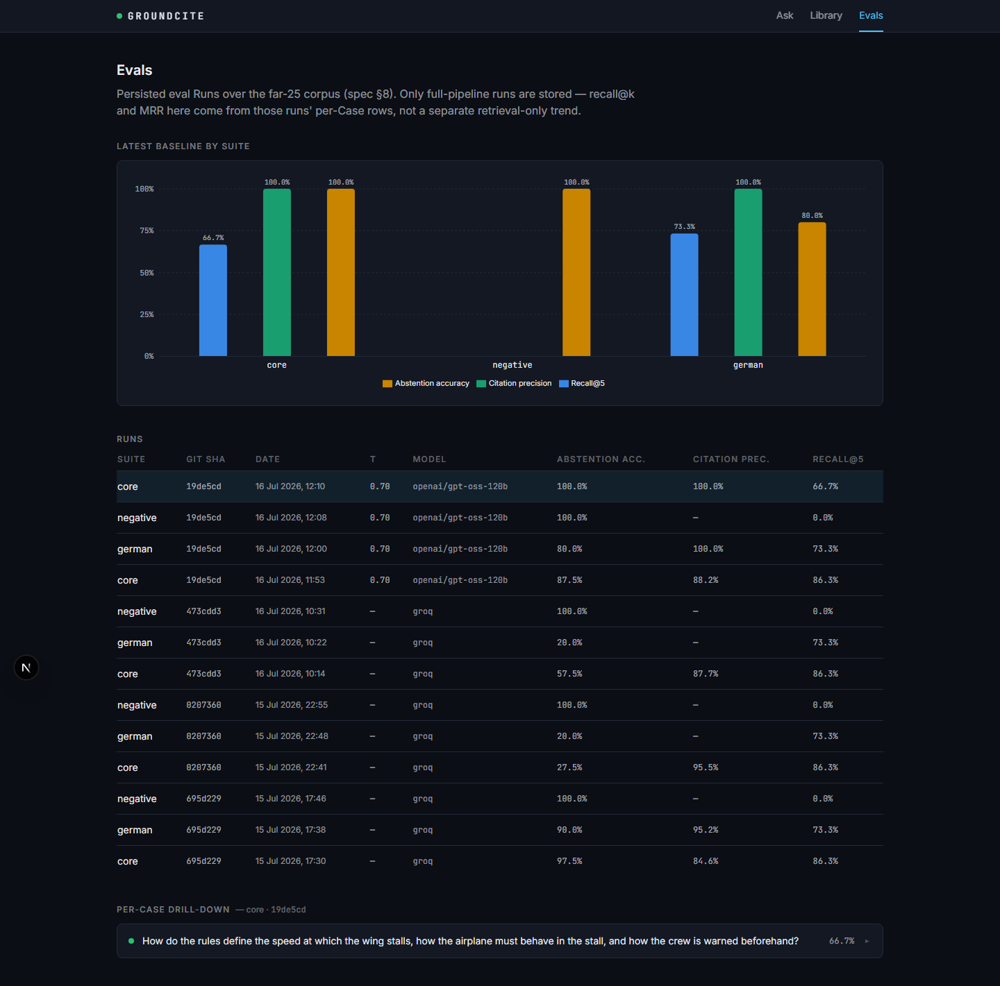

<!--
DRAFT — Week 5 (AD-7). NOT PUBLISHED.

Publishing this post, making the repo public, and adding the link to a CV
are OWNER ACTION per spec §15 / Week 5 instructions — outward-facing, hard
to reverse, explicitly not the model's to do. This file stops at a
reviewable draft for the owner to edit and publish.

Every number below is sourced from a committed file, not recalled or
rounded:
  - evals/baseline.json (sha 19de5cd, τ=0.70, openai/gpt-oss-120b)
  - docs/WEEK3_RESULTS.md Phase 6 (sha 695d229, τ=0.35, the first baseline)
  - docs/WEEK2_PLAN.md §3b (the pre-persistence retrieval-tuning history)
Cross-checked against README.md's "Benchmarks" table, which was diffed
against the same sources programmatically before this draft was written.
-->

# How I Cut a Hallucination Leak From 25% to 0% — and Why Recall@5 Didn't Move

I built GroundCite to answer questions over aerospace and engineering
standards (FAA FARs, NASA standards, and similar) with clause-level
citations, or nothing at all. The premise is narrow on purpose: in a
regulated domain, a plausible-sounding wrong citation is worse than no
answer. A generic RAG chatbot will happily invent "§25.4.2.1(b)" if the real
answer is spread across three sub-paragraphs of §25.1309. GroundCite is
built to refuse instead — and the interesting engineering problem turned out
to be making that refusal *reliable*, not making retrieval marginally
better.

This post is about the number that actually moved this project's safety
story, the number that didn't move at all (and why that's correct), and the
eval harness that made both of those things measurable instead of vibes.

## Test-first RAG

Before writing a line of retrieval code, I wrote 60 golden eval cases
against the corpus — direct clause lookups, semantic questions, cross-clause
synthesis, German-language questions on the English corpus, and 10
deliberately out-of-corpus questions that the system *must* refuse to
answer. Every expected clause in every case was hand-verified against the
actual PDF before the retrieval pipeline existed to score against it. The
eval harness (`groundcite eval run`) shipped in Week 2, before the `/ask`
endpoint did — the opposite order most RAG projects use, and the reason
every tuning decision below is a measured before/after instead of a
retro-justified guess.

## The retrieval foundation (and why it's flat now)

The first honest number, reranker off, no tuning: **core suite recall@5 =
0.769**. Two real fixes moved it from there to where it sits today:

| | recall@5 (core) | recall@10 | MRR |
|---|---|---|---|
| first baseline (reranker off) | 0.769 | 0.844 | 0.811 |
| + cross-encoder reranker | 0.856 | 0.896 | 0.824 |
| + de-hyphenation fix (final) | **0.863** | **0.902** | **0.850** |

The de-hyphenation fix is a good example of what this kind of harness
catches: `websearch_to_tsquery`'s lexical matching only works on whole
words, and the PDF-to-text extraction had been silently splitting words
across line breaks — "seconds" stored as the tokens "sec" and "onds". Fixing
it moved the reranker-off number the most (+3.1 recall@5), because lexical
retrieval was the half of hybrid search actually broken by it.

That **0.863** has not moved since — it's identical across every
full-pipeline eval run this project has persisted (four git shas, spanning
a threshold retune and a model swap). That's not stagnation; retrieval and
generation are genuinely separate concerns here, and once chunking + fusion
+ reranking were fixed, nothing downstream of that touches ranking. If
you're expecting this post to end with a bigger recall@5 number, it won't —
**0.863, stable, and here's why that's the right number to report**, not a
dressed-up one.

## The finding that mattered: Gate A doesn't separate the two populations cleanly

The interesting result came from stress-testing the abstention gate itself,
not from chasing retrieval percentage points. GroundCite's core contract
is: if nothing retrieved is good enough, refuse — the "Gate A" step in the
pipeline compares the top reranked score against a threshold (`τ_retrieval`)
before generation is ever invoked.

The first thing the eval harness found, before generation even entered the
picture: **on the raw fused-retrieval score (no reranker), grounded and
must-abstain questions were statistically indistinguishable** — 25 of 40
grounded cases scored *at or below* the best must-abstain case. The
reranker fixed most of this (a ~20x gap in median score between the two
populations), but not all of it: even with the reranker, the tails
overlapped. At the spec's original default threshold, τ=0.35:

- **3 of 12 must-abstain questions (25.0%) passed Gate A's retrieval check
  on raw score alone.**

That's the real bad number this project needed to confront — not a
retrieval percentage, but a live path to a hallucinated citation on an
out-of-corpus question. ("Which clause of 14 CFR Part 25 prescribes minimum
en-route altitudes over mountainous terrain?" scored 0.6891 — well above
0.35 — despite the corpus containing nothing about en-route altitudes.)

The system got all three right anyway *this time*, but only because the LLM
itself flagged `insufficient: true` rather than fabricating an answer from
weakly-related chunks (confirmed directly from the persisted pipeline
debug). That's a real second line of defense — GroundCite calls it Gate B —
but leaning on a language model's own self-honesty as the *only* thing
standing between an out-of-corpus question and a confident wrong citation
is not a safety margin I was comfortable shipping.

## Zero-leak: sweeping τ against the real score distribution

Because every case's actual retrieval score was already persisted, tuning
the threshold didn't need a single re-ask — just arithmetic over data
already in Postgres:

| τ | must-abstain leak (Gate A alone) |
|---|---|
| 0.35 (spec default) | 25.0% (3/12) |
| 0.45 | 16.7% (2/12) |
| 0.50–0.65 | 8.3% (1/12) |
| **0.70** | **0.0% (0/12) — first zero-leak τ** |

**τ_retrieval moved from 0.35 to 0.70.** At that threshold, re-run clean
against the full 60-case suite: **0 of 60 must-abstain questions were ever
answered GROUNDED** — the core safety contract held on retrieval score
alone, not generation-time self-honesty.

That's the headline result. It has a real, stated cost, not a hidden one:
overall abstention accuracy on questions the system *should* be able to
answer fell from **0.967 (58/60) to 0.900 (54/60)** — six more
grounded-eligible questions now wrongly abstain rather than answer. That's
the trade this project made deliberately: fewer answered questions, in
exchange for zero measured hallucination risk on out-of-corpus questions.
For a regulated-domain tool, that's the right side of the trade.

Citation quality moved the same direction: mean citation precision across
all 60 cases rose from **0.862 to 0.901** — a smaller, secondary win
alongside the real one.

| suite | abstention acc. (τ=0.35) | abstention acc. (τ=0.70) | citation precision (τ=0.35) | citation precision (τ=0.70) |
|---|---|---|---|---|
| core | 0.975 | 0.900 | 0.846 | 0.885 |
| german | 0.900 | 0.800 | 0.952 | 1.000 |
| negative | 1.000 | 1.000 | — | — |
| **all 60** | **0.967** | **0.900** | **0.862** | **0.901** |

(`negative` is 10 out-of-corpus questions where correct behavior is always
abstain, so `mean_citation_precision` is structurally undefined — nothing
is ever grounded there to have a precision. Shown as "—", not zero.)

## Making the numbers browsable, not just committed

The eval harness persists every run — retrieval scores, citations, the
abstention decision, latency — to Postgres, and the `/evals` page in the
running app reads it directly: a runs table across every tracked git sha
and suite, a chart of the three headline metrics per suite, and a per-case
drill-down showing exactly which clauses were expected versus which the
system actually cited, hit/miss highlighted.

The chart deliberately does *not* connect the four tracked runs with a
line — they span a threshold retune and a model swap, and a connecting line
would imply a comparability across configs that isn't there. Each suite
shows its latest run's three headline numbers as a grouped bar instead,
with the git sha named in the tooltip.

A short capture of the full loop — ask a question, watch it stream to a
grounded answer, click a citation into the source document, ask an
out-of-corpus question and watch it correctly refuse, then look at the eval
history behind both — is in [`docs/demo/`](demo/) (`demo.webm`, ~1m23s,
recorded live against the real running app and the real corpus, not
staged).

## The part that's still honest to say plainly

`faithfulness` — an LLM-judge metric for whether each citation actually
entails its claim — is not measured in either baseline. It needs a second
model provider distinct from the answering model (judge ≠ answerer), and
that's not configured yet. The `/evals` page shows this column as
unmeasured rather than hiding it. It's a real gap, not a secret one.

The retrieval numbers also come with a structural asterisk worth stating
outright: `negative`-suite recall is 0.0 by construction (every case there
has no expected clauses to recall), and `german`-suite outperforms `core`
on raw recall partly because clause numbers survive translation intact and
fire an exact-match fast path — a real result, but one that says as much
about the corpus's clause-numbering convention as about retrieval quality.

## Why this is the story, not a bigger recall number

The honest version of this project's results is: retrieval got good early
and stayed flat, and the real engineering work since then has been making
the *refusal* trustworthy — measured, tuned against real data, and
verifiable by anyone who runs the eval suite themselves. An eval harness
that only reports numbers when they look good isn't an eval harness, it's
marketing. This one reports 0.863 as flat because it's flat, and 25%→0% as
the number that actually mattered, because it did.

---

*GroundCite is open source (Apache-2.0). The corpus used throughout this
post is 14 CFR Part 25 (FAA FARs), US public domain. [Repo link — pending;
see the Week 5 owner checklist.]*
